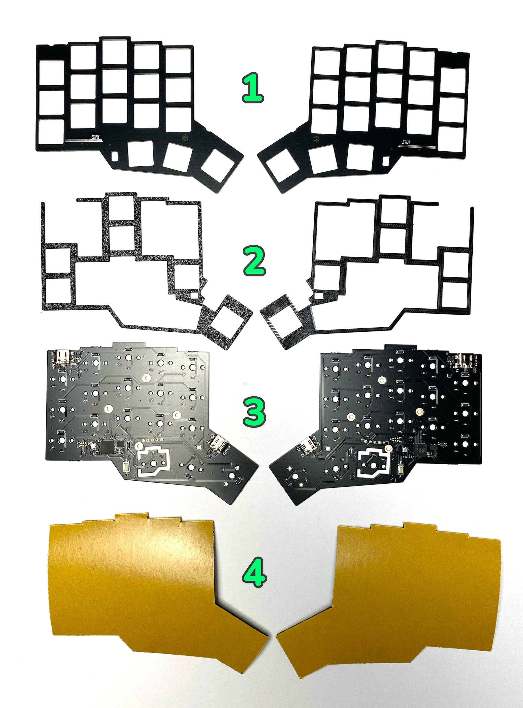
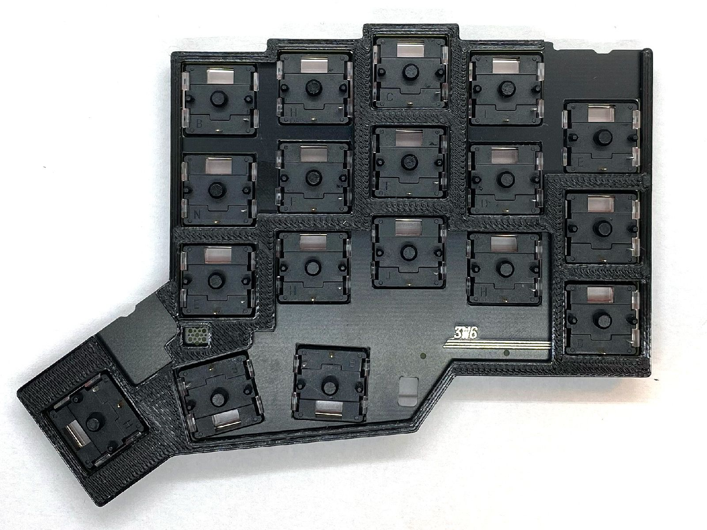
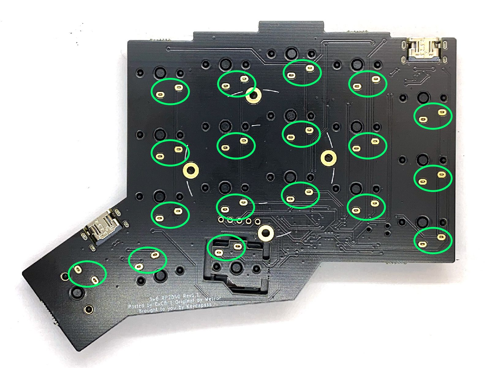
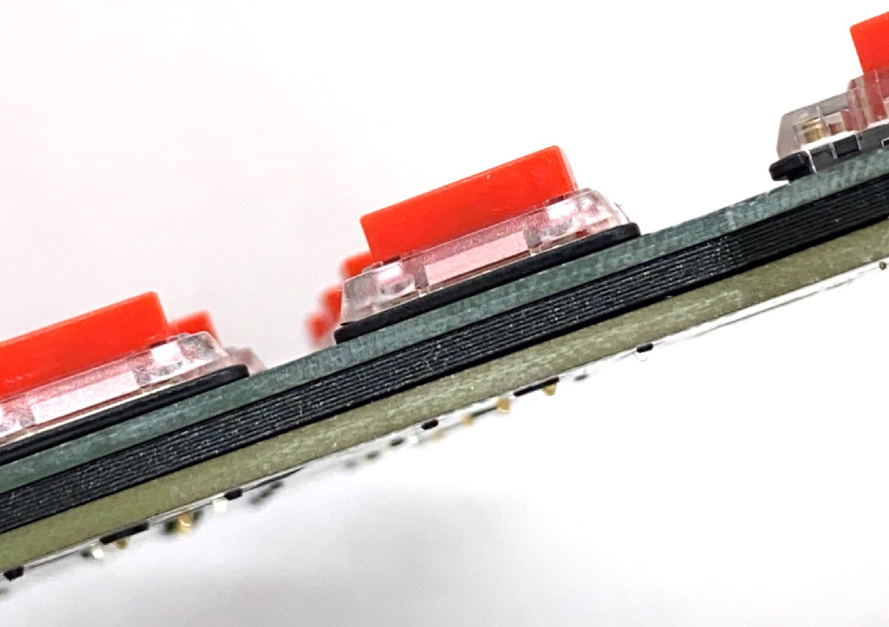

# 3w6 Build Guide

## BOM

### Parts included in the kit

| Part name     | Qty | Remarks                                  |
| :------------ | :-- | :--------------------------------------- |
| Top plates    | 2   | Nr. 1 on the image below                 |
| Spacer plates | 2   | Nr. 2 on the image below, 3D printed PLA |
| PCB's         | 2   | Nr. 3 on the image below                 |
| Foam          | 2   | Nr. 4 on the image below, self-adhesive  |

### Additionally required parts

| Part name                      | Qty | Remarks                                    |
| ------------------------------ | --- | ------------------------------------------ |
| Choc V1 switches               | 36  | Choc V2 switches are __not__ supported     |
| 1U Choc keycaps (Lo Profile)   | 24  | MX keycaps are __not__ supported           |
| 1.5U Choc keycaps (Lo Profile) | 2   | MX keycaps are __not__ supported           |
| USB-C cable                    | 1   | To connect the keyboard to your computer   |
| USB-C to USB-C cable           | 1   | To connect both halfs, 20cm lenght is good |

### Optional parts

| Part name                 | Qty | Remarks                   |
| ------------------------- | --- | ------------------------- |
| Pimoroni Trackball module | 1   | support on the right half |

## Assembly

Attach the Choc V1 switches (36x) to the top plates and pay attention to the switch orientation. The lower row has a different orientation.

Check carefully if all switch pins are staight.

Put the 3D printed spacer on top of the PCB's.  
The SMD components must face up. Pay attention that left and right spacer are different.

Put the assembled top plates with the switches on the PCB's with the spacer.  
Do not press to hard. Turn the PCB's and check from the bottom view, if all switch pins are align with the holes in the PCB.

If all switch pins are aligned, press the top plate and the PCB together.  
If you have problems to close the gap, probably a switch pin is bent.

While you press the PCB down, solder all switch pin's (green marked)

Connect both half's with a USB-C to USB-C cable and connect the master side (left) with a USB-C cable to your computer.

Open [QMK Configurator page](https://config.qmk.fm/#/test) and test if all switches trigger a key press. If not check the corresponding solder point for the switch.

If everything works as expected, you can attach the self-adhesive foam to the underside.

The complete assembled 3W6 Split Keyboard should have 4 layers.

